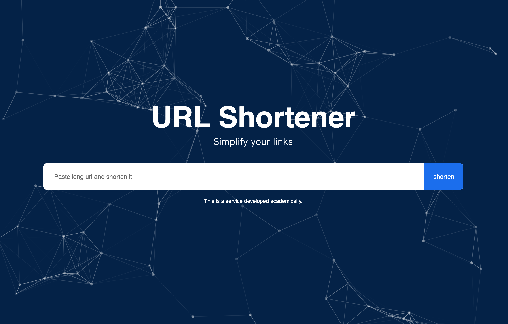

<h1 align="center">
  kmz.im ✂️: URL shortener with an airtable backend
</h1>

  

This is a simple short-url service that works with
[next.js](https://nextjs.org/) and uses [airtable](https://airtable.com).

## 🚀 Live demo

[kmz.im](https://kmz.im/)

Now go ahead and test that your redirects are working as expected. Just go to
the short URL version of your netlify app and it should redirect you like so:
http://kmz.im/codeBase -> https://github.com/khriztianmoreno/short-urls

If that works you're on the right track!

## 💫 Deploy

